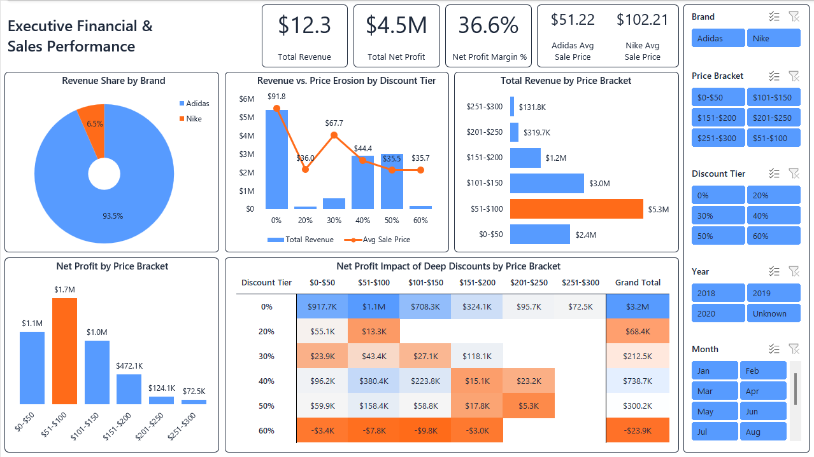
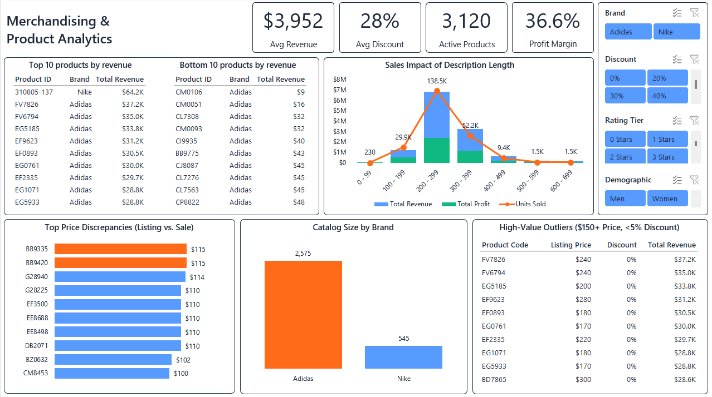
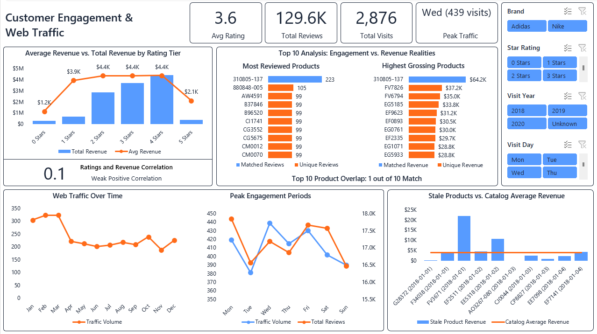

# 📊 Retail Merchandising, Pricing Optimization & Customer Engagement: Interactive Excel Dashboard


## Table of Contents
1. [Project Overview & Business Case](#1-project-overview--business-case)
2. [Tools & Technologies](#2-tools--technologies)
3. [Interactive Dashboard Previews & Executive Insights](#3-interactive-dashboard-previews--executive-insights)
4. [Repository Structure & How to Use](#4-repository-structure--how-to-use)

## 📑 1. Project Overview & Business Case

### The Business Case
An online sportswear retailer needs to optimize its pricing, merchandising, and marketing strategies for its two primary vendor brands (**Adidas** and **Nike**). By analyzing the relationships between pricing brackets, promotional discount tiers, customer sentiment, and web traffic, the business aims to maximize revenue and eliminate net margin erosion.

### The Client & Stakeholders
*   **Client:** Mid-sized, multi-brand E-commerce Sportswear Retailer.
*   **Primary Stakeholders:** Head of Merchandising and E-commerce Marketing Director.

### The Problem
*   **Margin Erosion:** Inconsistent promotional discounting lacks visibility into net profit impacts, leading to negative margins on heavily discounted items.
*   **Inventory Inefficiency:** Inability to differentiate between high-performing core SKUs and dormant, low-revenue "long-tail" inventory.
*   **Unmapped Engagement:** Lack of clarity on whether website traffic spikes and customer review volumes actively translate into sales.

### Dataset Source
The raw relational database (`retailDB.sqlite`) was sourced from Kaggle: [Retail E-Commerce Database](https://www.kaggle.com/datasets/angelobejaranociotti/retail-db?select=retailDB.sqlite).

### Modeled Fields & Assumptions
The source database contains no cost or unit-sales columns. To demonstrate profit and volume logic, two fields were **modeled** rather than measured:

* **`est_unit_cost`** — estimated at **45% of listing price**. All net profit and margin figures (including the headline **$4.5M / 36.6% margin**) are downstream of this illustrative assumption and scale with it.
* **`units_sold`** — derived as **revenue ÷ sale price**. This is an *implied* sales volume, not an actual unit count, and is used only to illustrate volume-based comparisons.

These fields are intentional analytical estimates included to complete the profit narrative; they are not ground-truth figures from the source data.

### My Role
**Lead Retail Data Analyst.** I extracted and inspected the raw SQLite database using **Python & Jupyter Notebooks**, then performed data cleaning, transformation, and structured modeling inside **Microsoft Excel** to build an interactive, multi-page executive dashboard.

## 🛠️ 2. Tools & Technologies

### Core Tech Stack
* **SQLite:** Stored and managed the raw relational e-commerce database (`retailDB.sqlite`).
* **Python & Jupyter Notebooks (`pandas`, `sqlite3`):** Connected to the database to extract relational tables into raw CSV files (`01_retailDB_sqlite_to_csv.ipynb`).
* **Microsoft Excel Ecosystem:** Employed as the end-to-end data engineering, modeling, and business intelligence platform.

### Microsoft Excel: Engineering & Architecture

#### 1. ETL Pipeline (Power Query & M Language)
Rather than manually cleaning data in sheets, an automated ETL pipeline was engineered using Power Query:
* **Data Cleaning:** Standardized null values, trimmed whitespace across text columns, and corrected decimal/currency formatting.
* **Relational Data Modeling:** Executed Left Outer Joins (`Table.NestedJoin`) across five disparate CSV extracts (`brands`, `finance`, `info`, `reviews`, `traffic`) to compile a unified, analytical `Master_Table`.

#### 2. Workbook Architecture & Modeling
To ensure the dashboard dynamically updates without manual intervention, the workbook utilizes a structured 3-tier architecture separating raw data, calculation engines (`Executive_Engine1`, `Merchandising_Engine1`, `Customer_Engine1`), and presentation layers:
* **Feature Engineering:** Built automated categorization columns inside `Master_Table` using structured table syntax:
    * *Price Brackets:* Segmented continuous listing prices into $50 bands via `=IFS()`.
    * *Copy Bucketing:* Grouped description lengths into 100-character buckets via `=FLOOR()`.
    * *Demographic Parsing:* Extracted target consumer segments from product titles via nested `=IF(ISNUMBER(SEARCH()))`.
* **Dynamic Array Calculation Engines:** Leveraged modern Excel formulas (`FILTER`, `TAKE`, `SORT`, `XLOOKUP`) to auto-generate Top 10 rankings, price gap matrices, and statistical correlations (`CORREL`) without relying on static helper tables.
* **Auto-Expanding Dynamic Charts:** Engineered dynamic Named Ranges powered by `=OFFSET()` to force chart axes (`SERIES`) to automatically expand or contract based on active slicer selections, eliminating empty axis gaps.

## 🖥️ 3. Interactive Dashboard Previews & Executive Insights

### Page 1: Executive Financial & Sales Performance



#### Strategic Questions & Findings:
1. **What is the total revenue generated, and how does the revenue share split between Adidas and Nike?**
   * **Insight:** Total business revenue reached **$12.3M** with an *estimated* net profit of **$4.5M** (36.6% margin). Revenue share is heavily dominated by Adidas (**93.5%**), while Nike accounts for **6.5%**.

2. **What is the optimal discount tier (e.g., 0%, 20%, 50%) that maximizes total revenue without heavily eroding the base price?**
   * **Insight:** The **0% discount tier (full price)** generates the majority of revenue (**~$5.4M**) at the highest average sale price (**$91.80**). Among discounted items, the **40% tier** captures the highest revenue (**~$3.0M**), though average sale price drops to **$44.40**.
3. **How does total revenue distribute across different product price brackets?**
   * **Insight:** Revenue is heavily concentrated in the lower-to-mid brackets: the **$51–$100 bracket** leads by far (**$5.3M**), followed by **$101–$150 ($3.0M)** and **$0–$50 ($2.4M)**. Higher price brackets ($151+) contribute minimal revenue.
4. **How do average sale prices compare between the two brands?**
   * **Insight:** Nike positions as a premium offering with an average sale price of **$102.21**, nearly double that of Adidas (**$51.22**).
5. **Are there specific product price brackets (e.g., $0-$50, $51-$100) that drive the majority of the business's bottom line?**
   * **Insight:** Yes. The **$51–$100 bracket** drives the highest bottom line (**$1.7M net profit**), followed by **$0–$50 ($1.1M)** and **$101–$150 ($1.0M)**.
6. **How do deep discounts impact the net profit across different price brackets?**
   * **Insight:** Deep discounting at the **60% threshold** completely destroys unit economics, generating **negative net profit across every single price bracket** (totaling **-$23.9K**).

### Page 2: Merchandising & Product Analytics



#### Strategic Questions & Findings:
1. **What are the top 10 and bottom 10 products by revenue, and what is their corresponding brand?**
   * **Insight:** The #1 top-grossing product is a **Nike** SKU (`310805-137` generating **$64.2K**), while the remaining 9 top spots are held by Adidas (led by `FV7826` at **$37.2K**). Conversely, the Bottom 10 products are exclusively Adidas items generating negligible revenue between **$9 and $48**.
2. **How does the volume of unique products (catalog size) compare between the two brands?**
   * **Insight:** Adidas dominates the catalog with **2,575 active SKUs**, outnumbering Nike (**545 SKUs**) by nearly 5:1.
3. **Which specific products have the highest discrepancy between their original listing price and actual sale price?**
   * **Insight:** Footwear SKUs `BB9335` and `BB9420` lead the catalog with the highest absolute dollar gap, each dropping **$115** from listing to sale price, followed closely by `G28940` (**$114 gap**).
4. **Do products with longer, more detailed descriptions correlate with higher sales performance?**
   * **Insight:** While overall statistical correlation is weak ($r = 0.23$), products in the **200–299 character bucket** strongly outperform all others, driving the highest **implied sales volume** and capturing the highest total revenue (**~$6.8M**).

5. **Are there "sleeping giants"—products with high listing prices and low discounts that still generate top-tier revenue?**
   * **Insight:** Yes. Several premium SKUs priced between **$170 and $300** sell at **0% discount (full price)** yet still generate top-tier revenue, led by `FV7826` (**$37.2K**) and `FV6794` (**$35.0K**).

### Page 3: Customer Engagement & Web Traffic



#### Strategic Questions & Findings:
1. **Is there a measurable correlation between product ratings and total revenue?**
   * **Insight:** There is only a **weak positive correlation ($r = 0.10$)** between star ratings and total revenue, proving that brand equity and pricing tiers drive top-line revenue far more than review scores.
2. **Which products generate the highest volume of user reviews, and do these align with the highest-grossing items?**
   * **Insight:** High review volume rarely equals high revenue. There is only a **1 out of 10 match** between the most-reviewed and highest-grossing SKUs (matched solely by Nike SKU `310805-137` with **223 reviews** and **$64.2K revenue**).
3. **How has web traffic trended over time, and what are the peak periods of site engagement?**
   * **Insight:** Monthly web traffic peaks heavily in **Q1 (Jan–Mar recording ~300–323 visits/month)** before dropping sharply in Q2–Q4 (~200 visits/month). On a weekly basis, traffic peaks midweek on **Wednesday (439 visits)** and **Friday (~430 visits)**.
4. **Do products that haven't been visited recently (stale traffic) map directly to the lowest revenue generators?**
   * **Insight:** No. Several items with stale traffic dates (early Jan 2018) drastically outperform the **$3,952 catalog average revenue**, led by SKU `FV3671` (**~$22K**) and SKU `EE5318` (**~$10.5K**), proving significant untapped revenue potential if re-engaged.

## 📂 4. Repository Structure & How to Use

### Repository Structure
```text
├── Assets/
│   ├── customer_engagement_and_web_traffic.png
│   ├── dash_gif.gif
│   ├── executive_financial_and_sales_performance.png
│   └── merchandising_and_product_analytics.png
├── Dataset/
│   └── Raw/
│       ├── Extracted_Tables/
│       │   ├── brands.csv
│       │   ├── finance.csv
│       │   ├── info.csv
│       │   ├── reviews.csv
│       │   └── traffic.csv
│       └── retailDB.sqlite
├── Excel/
│   └── retail_merch_dashboard.xlsx
├── Python/
│   ├── 01_retailDB_sqlite_to_csv.ipynb
│   └── 02_inspection.ipynb
└── README.md
```

> **⚠️ Note on Raw Dataset Files:** To keep this repository lightweight, raw dataset files (`retailDB.sqlite` and extracted `.csv` files) are excluded via `.gitignore`. The folder structure is preserved. To run the extraction pipeline locally, download `retailDB.sqlite` from the Kaggle source referenced in Section 1 and place it into `Dataset/Raw/`.

### How to Use This Project

#### 1. Exploring the Excel Dashboard
1. Download or clone this repository to your local machine:

    ```bash
    git clone https://github.com/ZoranG99/Retail_Merchandising_Pricing_Optimization_And_Customer_Engagement.git    
    ```
2. Open `Excel/retail_merch_dashboard.xlsx` in **Microsoft Excel (Microsoft 365 or 2021+)**. *Note: Older Excel versions may not support Modern Dynamic Array formulas (`FILTER`, `TAKE`, `SORT`, `XLOOKUP`).*
3. Navigate across the three interactive sheets (`Executive`, `Merchandising`, `Customer`) and use the interactive slicers on the right panels to filter metrics dynamically by Brand, Listing Price Bracket, Discount Tier, and Date ranges.

#### 2. Running the Extraction Pipeline (Optional)
1. Ensure you have Python installed with `pandas` and `jupyter`:

    ```bash
    pip install pandas jupyter
    ```
2. Launch Jupyter Notebook and execute `Python/01_retailDB_sqlite_to_csv.ipynb` to extract tables from `retailDB.sqlite` into the `Dataset/Raw/Extracted_Tables/` directory.
3. Run `Python/02_inspection.ipynb` to view exploratory data analysis and schema inspection.